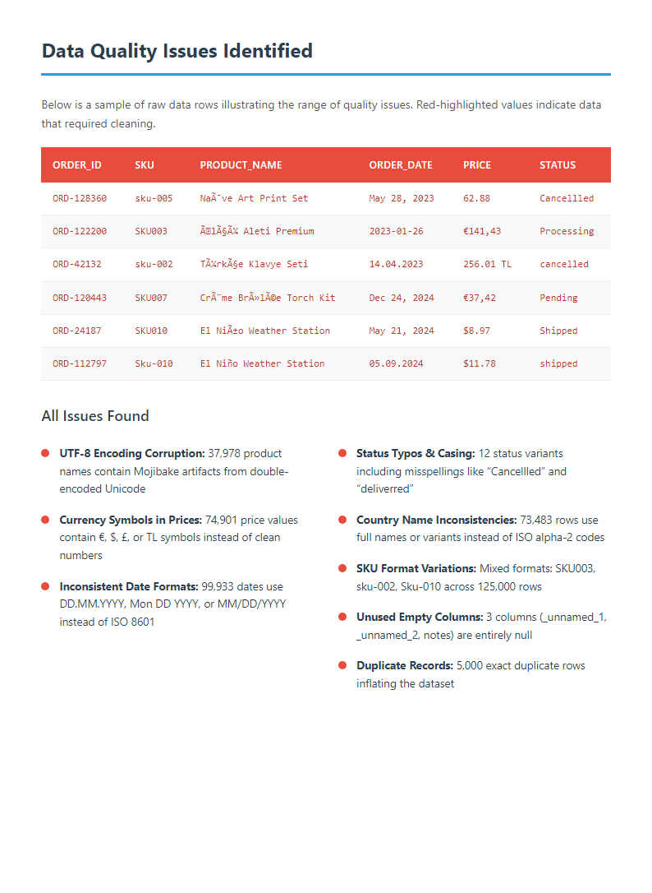
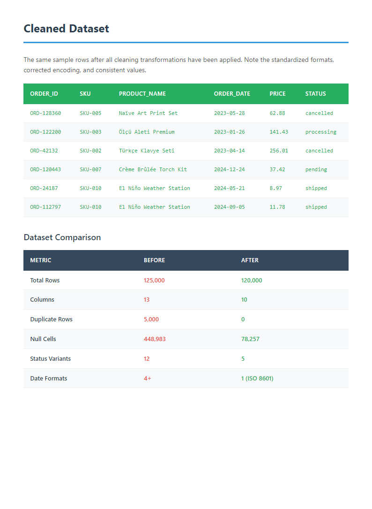
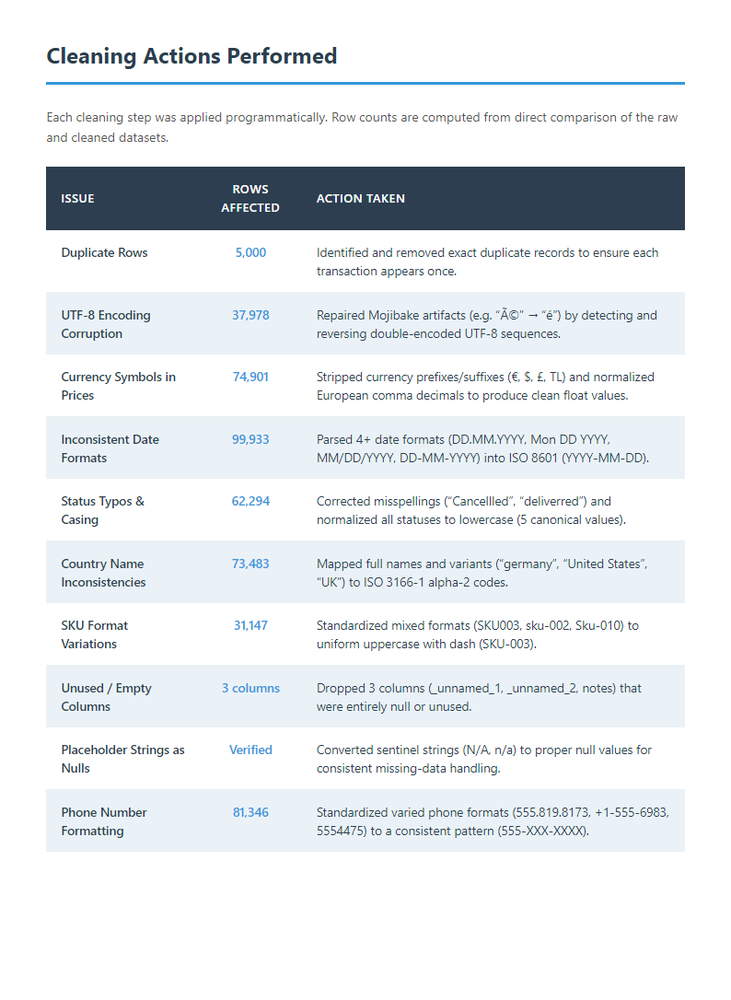
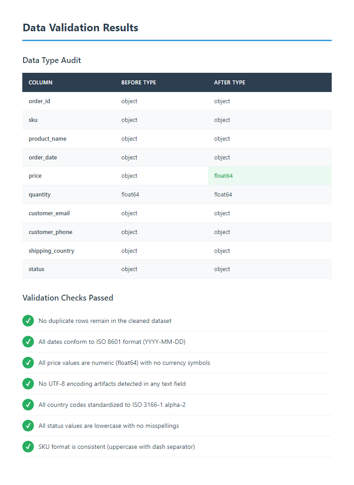

# Large-Scale E-commerce Data Cleaning & Standardization

[](https://www.python.org/)
[](https://pandas.pydata.org/)
[](https://jupyter.org/)
[](LICENSE)

> **125,000 rows · 8 data quality issues · Fully automated pipeline · ~15 sec runtime**

An end-to-end automated data cleaning pipeline that transforms a messy, real-world-style e-commerce export into analysis-ready data. Designed to reflect the kind of data quality problems routinely encountered in Shopify, WooCommerce, and custom ERP exports.

---

## The Problem

Manual cleaning of large exports is slow, inconsistent, and error-prone. This dataset arrives with 8 compounding issues across 125K rows:

| Issue | Affected Rows |
|---|---|
| Duplicate records | 5,000 |
| Mixed date formats (5 variants) | 99,933 |
| Currency symbols & locale formats ($, EUR, TL) | 74,901 |
| UTF-8 encoding corruption (mojibake) | 37,978 |
| Inconsistent country names | 73,483 |
| Status field typos & casing | 62,294 |
| SKU casing inconsistencies | 31,147 |
| Placeholder nulls (N/A, -, empty strings) | multiple columns |

---

## The Solution

A **10-step Python pipeline** that resolves all issues automatically:

```
Step 1  → Drop fully empty columns
Step 2  → Remove exact duplicate rows
Step 3  → Standardise null representations → NaN
Step 4  → Repair UTF-8 encoding (Latin-1 mojibake)
Step 5  → Normalise dates → ISO 8601 (YYYY-MM-DD)
Step 6  → Clean prices → float (strips $, EUR, TL, fixes comma decimals)
Step 7  → Standardise SKUs → uppercase SKU-XXX format
Step 8  → Map country names → ISO alpha-2 codes
Step 9  → Fix status typos → canonical lowercase values
Step 10 → Standardise phone numbers → XXX-XXX-XXXX
```

---

## Results

| Metric | Before | After |
|---|---|---|
| Rows | 125,000 | 120,000 |
| Columns | 13 | 10 |
| Duplicate rows | 5,000 | 0 |
| Date formats | 5 | 1 (ISO 8601) |
| Currency formats | 5 | 1 (float) |
| Encoding errors | 37,978 | 0 |
| Null representations | 4+ variants | Standard NaN |

**Processing time: ~15 seconds** on a standard laptop.

---

## Screenshots

| Before: Raw Data | After: Cleaned Output |
|---|---|
|  |  |

| Cleaning Summary | Schema Comparison |
|---|---|
|  |  |

---

## Quick Start

```bash
pip install pandas numpy jupyter nbformat nbconvert

# 1 — Generate the messy dataset
python generate_messy_data.py

# 2 — Build and execute the cleaning notebook
python build_notebook.py
jupyter nbconvert --to notebook --execute data_cleaning_portfolio.ipynb \
  --output data_cleaning_portfolio.ipynb --ExecutePreprocessor.timeout=300

# 3 — (Optional) Generate the HTML case study
python build_case_study.py
```

---

## Project Structure

```
├── data_cleaning_portfolio.ipynb   # Full pipeline with executed outputs (start here)
├── messy_ecommerce_export.csv      # Raw input dataset (125K rows)
├── generate_messy_data.py          # Synthetic data generator (reproducible, seed=42)
├── build_notebook.py               # Programmatic notebook builder (nbformat)
├── build_case_study.py             # HTML case study generator
├── case_study.html                 # Visual case study (open in browser)
├── screenshots/                    # Before/after visuals
└── docs/plans/                     # Project planning documents
```

---

## Tech Stack

| Tool | Purpose |
|---|---|
| Python 3.10+ | Core language |
| Pandas | Data loading, transformation, pipeline |
| NumPy | Numerical operations, seed control |
| nbformat | Programmatic notebook generation |
| Jupyter / nbconvert | Notebook execution and export |

---

## Key Design Decisions

- **Synthetic data with fixed seed (`seed=42`)** — fully reproducible, safe to share publicly
- **Pipeline as a notebook** — each step is documented, visible, and independently testable
- **No external cleaning libraries** — intentional; demonstrates raw Pandas proficiency
- **Programmatic notebook generation** (`build_notebook.py`) — the notebook itself is version-controlled as an artefact, not hand-edited

---

## Notes

All data is synthetically generated for demonstration purposes. No real customer data is used or implied.

---

## License

[MIT](LICENSE) — free to use, adapt, and build upon.
